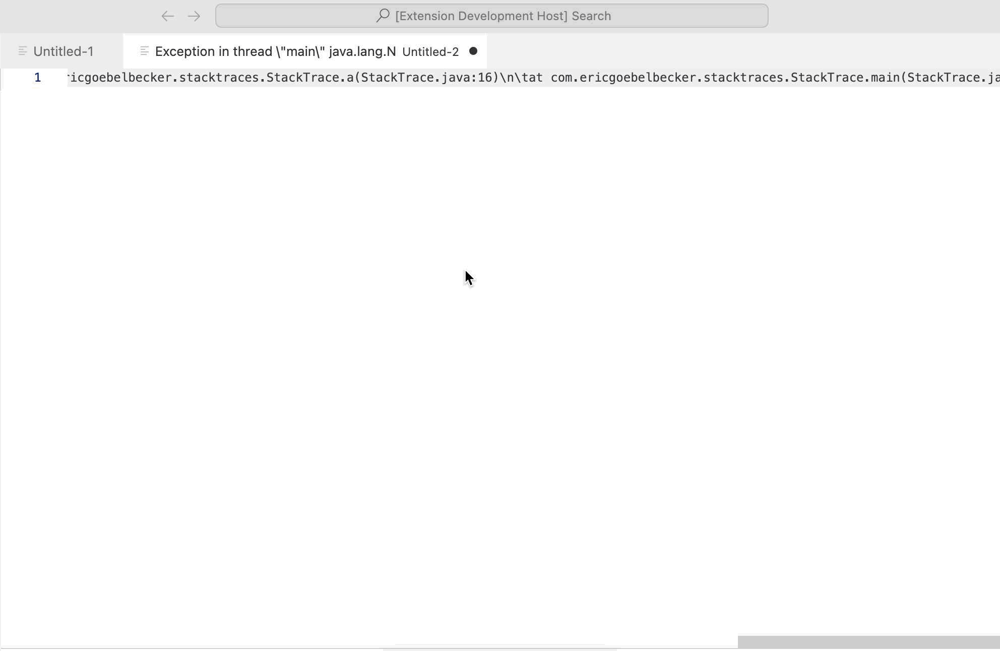

# Unescaper

VSCode extension replaces the following common escaped characters:
```
\n
\t
\r
\'
\"
\\
```

Useful to make stack traces from logs prettier. 

## Hotkeys
Hotkey: Ctrl + R + R (Windwos) / Cmd + R + R (Mac)




## Releases

### April 2024 - Initial version
### January 2026 - Added other common characters to escape
